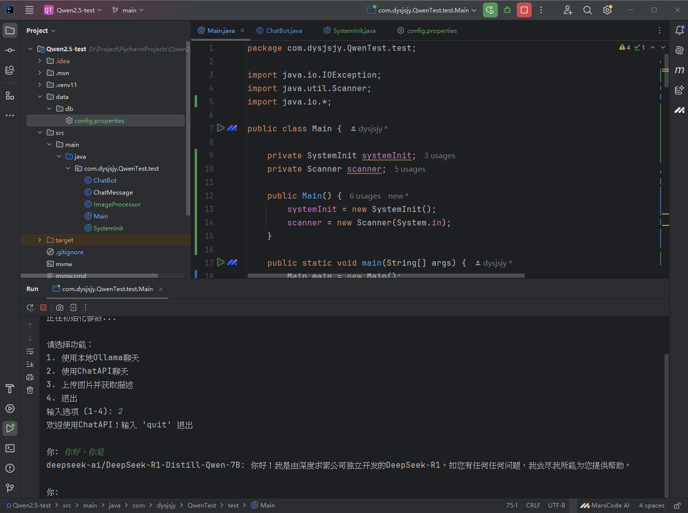

# dysjsjy的聊天工具测试项目

## 项目概述
本项目是一个Java小工具，旨在对接各种大语言模型（LLM）的API，支持使用本地Ollama进行聊天、调用ChatAPI（如DeepSeek）进行对话，以及上传图片获取描述等功能。通过简单的命令行交互，用户可以方便地与不同的语言模型进行交互，同时处理图片相关任务。



## 功能特性
1. **本地Ollama聊天**：支持与本地部署的Ollama模型进行交互，默认使用`qwen-2.5-1.5B-Instruct`模型。
2. **ChatAPI聊天**：调用ChatAPI（如DeepSeek）进行对话，使用`deepseek-ai/DeepSeek-R1-Distill-Qwen-7B`模型。
3. **图片描述**：上传图片并获取模型对图片的描述信息。
4. **对话历史记录**：在与模型交互过程中，会记录对话历史，以便后续查看。

## 项目结构
```
ChatToolsTest/
├── mvnw.cmd                  # Maven包装器脚本
├── pom.xml                   # Maven项目配置文件
├── python/
│   └── test.py               # Python相关测试脚本
├── src/
│   └── main/
│       └── java/
│           └── com/
│               └── dysjsjy/
│                   └── ChatToolsTest/
│                       └── test/
│                           ├── ChatBot.java          # 聊天机器人核心类
│                           ├── ChatMessage.java      # 聊天消息类
│                           ├── ImageProcessor.java   # 图片处理类
│                           ├── Main.java             # 程序入口类
│                           └── SystemInit.java       # 系统初始化类
├── .gitignore                # Git忽略文件配置
└── README.md                 # 项目说明文档
```

## 环境要求
- **Java**：JDK 8及以上版本
- **Maven**：用于项目依赖管理和构建

## 配置步骤
1. **配置API信息**：在`data/db/config.properties`文件中配置API相关信息，包括`apiUrl`、`apiKey`、`ollamaApiUrl`和`chatAPIUrl`。
```properties
apiUrl=your_api_url
apiKey=your_api_key
ollamaApiUrl=your_ollama_api_url
chatAPIUrl=your_chat_api_url
```
2. **安装依赖**：使用Maven安装项目依赖。
```bash
mvn clean install
```

## 使用方法
### Java程序
1. **运行程序**：在项目根目录下，使用Maven运行程序。
```bash
mvn exec:java -Dexec.mainClass="com.dysjsjy.ChatToolsTest.test.Main"
```
2. **选择功能**：程序启动后，会显示功能菜单，用户可以根据提示输入相应的选项来选择功能。
```
欢迎使用dysjsjy的小工具
++++++++++++++++++++
正在初始化参数...

请选择功能：
1. 使用本地Ollama聊天
2. 使用ChatAPI聊天
3. 上传图片并获取描述
4. 退出
输入选项 (1-4): 
```

## 代码说明
### `ChatBot.java`
- 聊天机器人的核心类，负责与LLM API进行交互。
- 提供`sendMessage`和`sendMessageToDeepSeek`方法，分别用于与本地Ollama和ChatAPI进行对话。
- 维护对话历史记录，方便后续查看。

### `ChatMessage.java`
- 表示聊天消息的类，包含消息的角色（如`user`、`assistant`）和内容。

### `ImageProcessor.java`
- 图片处理类，负责将图片编码为Base64格式，并上传到API获取图片描述。

### `Main.java`
- 程序入口类，提供命令行交互界面，让用户选择不同的功能。

### `SystemInit.java`
- 系统初始化类，负责从`config.properties`文件中读取API配置信息。

## 注意事项
- 请确保`config.properties`文件中的API信息配置正确，否则可能会导致请求失败。
- 在处理图片时，请确保输入的图片文件路径正确，否则会提示“图片文件不存在”的错误信息。

### 项目展望更新

#### 未来功能规划
1. **数据库集成**：后续将集成SQLite数据库，用于存储和管理LLM的人物配置文件。这将使得LLM能够拥有更丰富的人物性格选择，用户可以通过加载不同的配置文件来改变LLM的行为和回复风格。
2. **人物性格定制**：通过SQLite数据库存储多种人物配置文件，用户可以轻松切换不同的人物性格，为与LLM的交互增添更多乐趣和个性化。
3. **语音交互功能**：计划为LLM配置Kokoro - TTS等语音合成技术，实现语音输出功能。同时，将支持通过麦克风进行语音输入，使用户能够以更自然的方式与LLM进行对话。

#### 技术实现思路
1. **SQLite集成**
    - **数据库设计**：设计合适的数据库表结构，用于存储人物配置文件的相关信息，如人物名称、性格描述、回复模板等。
    - **Java数据库操作**：使用Java的JDBC（Java Database Connectivity）技术连接SQLite数据库，实现数据的增删改查操作。
    - **配置文件加载**：在程序中实现从数据库中加载不同人物配置文件的功能，并将其应用到LLM的交互中。

2. **语音交互功能实现**
    - **语音合成**：集成Kokoro - TTS等语音合成技术，将LLM的回复文本转换为语音输出。可以使用相应的API或SDK来实现语音合成功能。
    - **语音输入**：使用Java的`javax.sound.sampled`包或第三方库（如CMU Sphinx）实现麦克风语音输入功能。将语音转换为文本后，再将其发送给LLM进行处理。

#### 待办事项
1. **数据库集成**
    - 设计SQLite数据库表结构
    - 实现Java与SQLite的连接和数据操作
    - 编写代码从数据库中加载人物配置文件

2. **语音交互功能**
    - 集成Kokoro - TTS语音合成技术
    - 实现麦克风语音输入和语音转文本功能
    - 优化语音交互的用户体验

#### 贡献与反馈
如果您对未来功能有任何建议或想法，欢迎提交Issue或Pull Request。我们期待与您一起完善这个项目！
